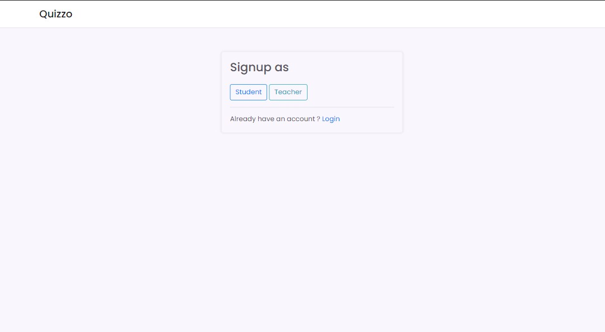

# Quizzo
[Live Website](https://vishwas2.pythonanywhere.com/)

## <u>Screenshots</u>

### Login and Signup pages
 
  

### Subjects page

### Profile page

### Subject specific pages

  

### Quiz Detail page
What teacher sees:

What student sees:

### Add a new subject option for teachers only
